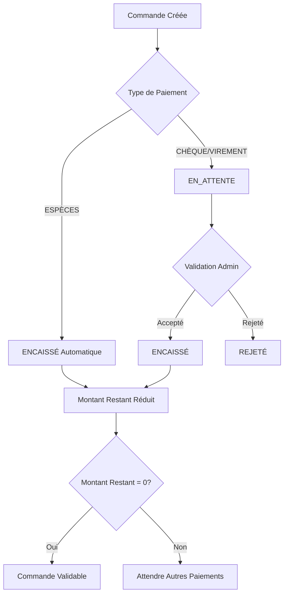

# 🛒 SmartShop - Système de Gestion E-Commerce

## 📋 Description
SmartShop est une application de gestion e-commerce complète développée avec **Spring Boot** et **Java**. Elle offre un système de gestion des commandes, des paiements multi-moyens, et un programme de fidélité client.

## ✨ Fonctionnalités Principales

### 🎯 Gestion des Clients
- Inscription et authentification
- Programme de fidélité (BRONZE, SILVER, GOLD, PLATINUM)
- Historique des commandes

### 📦 Gestion des Produits
- Catalogue produits avec stock
- Gestion des prix et disponibilité
- Catégorisation

### 🛍️ Système de Commandes
- Création de commandes multi-produits
- Calcul automatique des remises (fidélité + promo)
- Gestion des statuts : PENDING → CONFIRMED → DELIVERED

### 💳 Système de Paiements Multi-Moyens

| Moyen de Paiement | Limite | Statut Initial | Validation |
|-------------------|--------|----------------|------------|
| **ESPÈCES** | 20,000 DH max | ENCAISSÉ | Automatique |
| **CHÈQUE** | Aucune | EN_ATTENTE | Manuelle |
| **VIREMENT** | Aucune | EN_ATTENTE | Manuelle |

## 🚀 API Endpoints

### 👥 Gestion des Clients
```http
GET    /api/clients              # Liste tous les clients
POST   /api/clients              # Créer un nouveau client
GET    /api/clients/{id}         # Détails d'un client
PUT    /api/clients/{id}         # Modifier un client
DELETE /api/clients/{id}         # Supprimer un client
GET    /api/clients/{id}/orders  # Historique des commandes
```

### 📦 Gestion des Produits
```http
GET    /api/products             # Liste tous les produits
POST   /api/products             # Créer un nouveau produit
GET    /api/products/{id}        # Détails d'un produit
PUT    /api/products/{id}        # Modifier un produit
DELETE /api/products/{id}        # Supprimer un produit
```

### 🛍️ Gestion des Commandes
```http
GET    /api/orders               # Liste toutes les commandes
POST   /api/orders               # Créer une nouvelle commande
GET    /api/orders/{id}          # Détails d'une commande
PUT    /api/orders/{id}/validate # Valider une commande (ADMIN)
PUT    /api/orders/{id}/cancel   # Annuler une commande
PUT    /api/orders/{id}/reject   # Rejeter une commande (ADMIN)
```

### 💳 Gestion des Paiements
```http
POST   /api/payments             # Créer un paiement
PUT    /api/payments/{id}/validate # Valider un paiement (ADMIN)
PUT    /api/payments/{id}/reject  # Rejeter un paiement (ADMIN)
GET    /api/orders/{id}/payments  # Paiements d'une commande
```

### 🎫 Gestion des Codes Promo
```http
GET    /api/promocodes           # Liste tous les codes promo
POST   /api/promocodes           # Créer un code promo
GET    /api/promocodes/{id}      # Détails d'un code promo
PUT    /api/promocodes/{id}      # Modifier un code promo
DELETE /api/promocodes/{id}      # Supprimer un code promo
```

## 🔧 Technologies Utilisées

- **Backend**: Spring Boot 3.x, Java 17+
- **Base de données**: MySQL/PostgreSQL
- **ORM**: Spring Data JPA
- **Validation**: Bean Validation
- **Mapping**: MapStruct
- **Tests**: JUnit 5, Mockito
- **Documentation**: OpenAPI/Swagger

## 📊 Workflow de Paiement



## 🎯 Règles Métier

### 💰 Paiements
- **Limite ESPÈCES**: 20,000 DH maximum (Art. 193 CGI)
- **Paiements fractionnés**: Une commande peut être payée en plusieurs fois
- **Validation obligatoire**: Montant restant = 0 avant confirmation

### 🏆 Programme de Fidélité
- **BRONZE**: 0% de remise
- **SILVER**: 5% de remise
- **GOLD**: 10% de remise
- **PLATINUM**: 15% de remise

### 📋 Statuts des Commandes
- **PENDING**: En attente de paiement complet
- **CONFIRMED**: Payée et validée par admin
- **DELIVERED**: Livrée au client
- **CANCELED**: Annulée par le client
- **REJECTED**: Rejetée par l'admin

## 🚀 Installation et Démarrage

### Prérequis
- Java 17+
- Maven 3.6+
- MySQL/PostgreSQL

### Configuration
```properties
# application.properties
spring.datasource.url=jdbc:mysql://localhost:3306/smartshop
spring.datasource.username=your_username
spring.datasource.password=your_password
spring.jpa.hibernate.ddl-auto=update
```

### Démarrage
```bash
# Cloner le projet
git clone https://github.com/adilaitelhoucine1/SmartShop.git

# Installer les dépendances
mvn clean install

# Démarrer l'application
mvn spring-boot:run
```

## 🧪 Tests
```bash
# Exécuter tous les tests
mvn test
```

## 👨‍💻 Auteur
Développé par **ADIL Ait elhoucine** avec ❤️ pour la gestion e-commerce moderne

---
*SmartShop - Votre solution e-commerce intelligente* 🚀